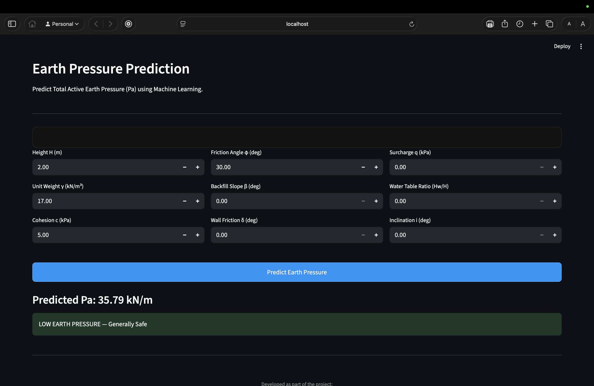

# Prediction of Earth Pressure on Retaining Wall  
## Using Analytical & Machine Learning Approaches

---

## 📌 Abstract

This project develops a Machine Learning model to predict **Total Active Earth Pressure (Pa)** acting on a retaining wall.  

The study compares:

- Classical soil mechanics theory (Rankine method)
- Linear Regression (statistical model)
- Random Forest Regressor (nonlinear ML model)

The objective is to evaluate whether machine learning can accurately approximate analytical earth pressure relationships and capture nonlinear soil behavior.

---

## 🏗 Engineering Background

In classical soil mechanics, active earth pressure is computed using Rankine theory:

### Active Earth Pressure Coefficient (Ka)

Ka = (1 − sinφ) / (1 + sinφ)

### Total Active Earth Pressure (Pa)

Pa = ½ γH²Ka + qHKa − 2cH√Ka

Where:

- H = wall height (m)
- γ = unit weight of soil (kN/m³)
- c = cohesion (kPa)
- φ = friction angle (degrees)
- q = surcharge (kPa)

The relationship is nonlinear due to:

- Trigonometric terms
- H² dependency
- Cohesion interaction

---

## 🎯 Project Objectives

- Develop ML model to predict Pa
- Compare Linear Regression and Random Forest
- Analyze feature importance
- Validate ML predictions against soil mechanics theory
- Build interactive GUI for prediction

---

## 📊 Dataset Description

Total Samples: 491  

Features Used:

- H_m
- gamma_kN_m3
- c_kPa
- phi_deg
- beta_deg
- delta_deg
- q_kPa
- Hw_by_H
- i_deg

Target Variable:

- Pa_kN_m

Derived variables were removed to prevent data leakage and ensure fair ML evaluation.

---

## 🤖 Model Performance

### Linear Regression

R² Score: 0.846  
RMSE: 47.92 kN/m  
MAE: 37.73 kN/m  

### Random Forest Regressor

R² Score: 0.932  
RMSE: 31.85 kN/m  
MAE: 23.85 kN/m  

### Interpretation

Random Forest significantly outperforms Linear Regression due to nonlinear soil behavior and H² dependency.

---

## 🔎 Feature Importance (Random Forest)

| Parameter        | Importance |
|------------------|------------|
| H_m              | ~0.49 |
| c_kPa            | ~0.33 |
| phi_deg          | ~0.07 |
| q_kPa            | ~0.04 |
| Others           | minor |

### Engineering Insight

- Wall height dominates due to quadratic relationship.
- Cohesion significantly reduces active pressure.
- Friction angle influences Ka.
- Surcharge increases lateral force.

Model behavior aligns with theoretical expectations.

---

## 🌐 Graphical User Interface

The project includes a Streamlit-based web application featuring:

- Instagram-inspired dark UI
- Real-time Pa prediction
- Green / Yellow / Red classification
- Negative pressure handling (Pa < 0 assumed as zero)

---

## ⚠ Handling Negative Earth Pressure

If Pa < 0:

No active pressure is mobilized.  
For structural design, Pa is assumed as zero.

Machine learning models interpolate within training data and may not extrapolate extreme cohesive behavior accurately.

---

## ▶ How to Run Locally

1. Clone repository:

git clone https://github.com/JAYESH-SOLMINDE/earth-pressure-ml.git  
cd earth-pressure-ml  

2. Create virtual environment:

python3 -m venv venv  
source venv/bin/activate  

3. Install dependencies:

pip install -r requirements.txt  

4. Run application:

streamlit run app.py  

---

## 📈 Analytical vs Machine Learning Comparison

| Method              | Nature            | Limitation |
|---------------------|------------------|------------|
| Rankine Theory      | Deterministic    | Simplified assumptions |
| Linear Regression   | Linear Approx.   | Cannot model nonlinear H² behavior |
| Random Forest       | Nonlinear ML     | Depends on training data range |

Random Forest effectively captures nonlinear interactions between soil parameters and wall geometry.

---
## 📸 Screenshots

### User Interface

### Low Earth Pressure Case

### High Earth Pressure Case

## 🏁 Conclusion

- Earth pressure behavior is nonlinear.
- Random Forest captures nonlinear interaction effectively.
- Model predictions align with soil mechanics theory.
- Machine learning can approximate analytical solutions when sufficient data is available.

---

## 👨‍💻 Developed By

Solminde  
Civil Engineering & Machine Learning Integration Project